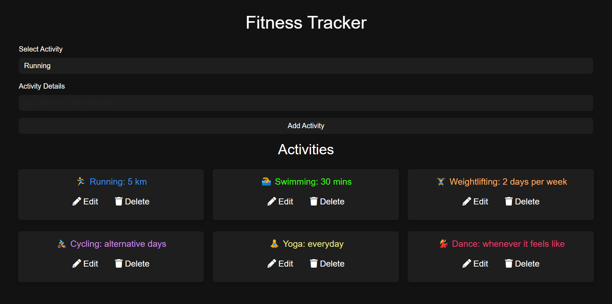

 <h1>Fitness Tracker Project</h1>
  
 

 
 
The Fitness Tracker is a web application that effectively employs Object-Oriented Programming (OOP) principles, particularly inheritance and polymorphism, to create a structured and maintainable codebase. In this project, we define a base class called Activity, which serves as the foundation for various fitness activities, such as Running, Swimming, Weightlifting, Cycling, Yoga, and Dance. Each of these activity types is represented as a subclass that inherits from the Activity class.

  
 <h2>Inheritance and Polymorphism</h2>
 
Using inheritance, each subclass can extend the properties and methods of the Activity class, enabling a clean and efficient design. For instance, the getDetails method is overridden in each subclass to provide unique emoji representations for different activities while still adhering to the common structure established in the parent class. This demonstrates polymorphism, allowing us to treat all activity types as instances of the base Activity class, thereby simplifying interactions within the code.

  
 <h2>Impact on Front-End and Back-End</h2>
 
The implementation of these OOP principles significantly enhances both the front-end and back-end functionalities of the application. On the front-end, the modular design allows for easier updates and extensions—new activities can be added with minimal changes to existing code. Each activity's unique features are encapsulated within its respective class, promoting better organization.

  
 
On the back-end, the use of OOP enables the application to manage user data more efficiently through local storage. Each activity's details are easily serialized and deserialized, maintaining their integrity across sessions. This results in a seamless user experience, where activity data persists even after a page refresh, showcasing the effective integration of OOP concepts with state management.

  
 <h2>CRUD Functionality</h2>
 
The application implements full CRUD (Create, Read, Update, Delete) functionality, allowing users to manage their fitness activities seamlessly. Users can:

 1.Create new activities by selecting an activity type and entering details. 
 2.Read their list of activities displayed in a user-friendly card format. 
 3.Update existing activities by editing their details, which is facilitated by removing the old entry and adding the updated one. 
 4.Delete activities to maintain a clean and relevant list.

  
 <h2>Local Storage</h2>
 
Local storage is used to persist activity data across user sessions. When users add or modify activities, the app saves this information in the browser's local storage, ensuring that their data remains intact even after a page refresh. This implementation enhances user experience by allowing for easy retrieval and manipulation of data without server-side dependencies.

  
 <h2></h2>
 
In summary, the Fitness Tracker project exemplifies how OOP principles like inheritance and polymorphism, combined with robust CRUD functionality, local storage, and responsive design, can lead to a more organized, scalable, and user-friendly application, bridging the gap between the front-end interface and back-end data management.

 #JavaScript #WebDevelopment #ObjectOrientedProgramming #FitnessApp #LocalStorage #Coding #Programming #TechForGood #OpenSource #FitnessTracker

 [live : ](https://fitness-tracker-oop-js-localstorage.netlify.app/)
