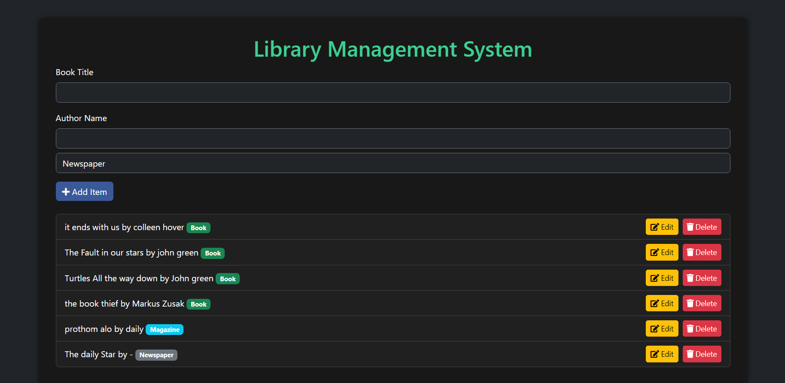

<h1>CRUD Library Management System using OOP JavaScript</h1>
 

 

<h2>Project Overview: Library Management System</h2>
 

This Library Management System showcases the use of Object-Oriented Programming (OOP) principles, specifically inheritance and polymorphism. The system defines a base Item class, from which specific item types—Book, Magazine, and Newspaper—inherit. Each subclass overrides methods to provide specific behaviors, demonstrating polymorphism.

 

The application also implements CRUD (Create, Read, Update, Delete) functionality, allowing users to manage library items effectively. Users can add new items, edit existing ones, and delete items as needed.

 

Data persistence is achieved through local storage, ensuring that items remain available even after a page refresh. This combination of OOP principles, CRUD operations, and local storage creates a robust, responsive and maintainable system for managing library resources.
