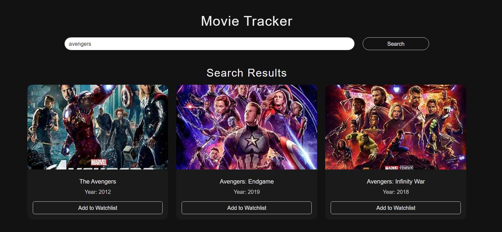

 <h1>Movie Tracker App</h1>
 
 

  
 

 The Movie Tracker App is a dynamic web application that showcases advanced Object-Oriented Programming (OOP) principles in JavaScript. This project serves as an excellent example of how to build a fully functional, responsive application utilizing CRUD (Create, Read, Update, Delete) operations using OMDB API.
  
 

 <h2>Key Features:</h2>
  
 <h3>OOP Implementation: </h3>
 
The app utilizes OOP concepts to create modular, reusable code that enhances maintainability and scalability. Encapsulation, inheritance, and polymorphism are effectively demonstrated in the design, allowing for a clean and organized structure.  

  
 

  <h3>CRUD Functionality: </h3>
  
Users can seamlessly search for movies using the OMDb API, add them to their watchlist, mark them as watched, and remove them from either list. Each action is designed to provide immediate feedback, enhancing the user experience.

   
  

  <h3>Local Storage Integration: </h3>
  
To ensure data persistence across sessions, the app employs local storage, allowing users to retain their watchlist and watched movies even after refreshing or closing the browser.

   
  

  <h3>Responsive Design: </h3>
  
Built using Bootstrap 5, the app features a modern, sleek design that adapts beautifully across various devices and screen sizes. The layout follows a minimalistic bento box style, enhancing usability and visual appeal.

   
  

  
The Movie Tracker App effectively demonstrates the application of Object-Oriented Programming principles and the development of a responsive web application. This project showcases practical use of CRUD functionality and local storage, allowing users to easily manage their movie preferences. With a focus on a clean and user-friendly interface, the app serves as a solid example of modern web development practices.

  [live demo:](https://crud-movietracker-api-oop-localstorag.netlify.app/)